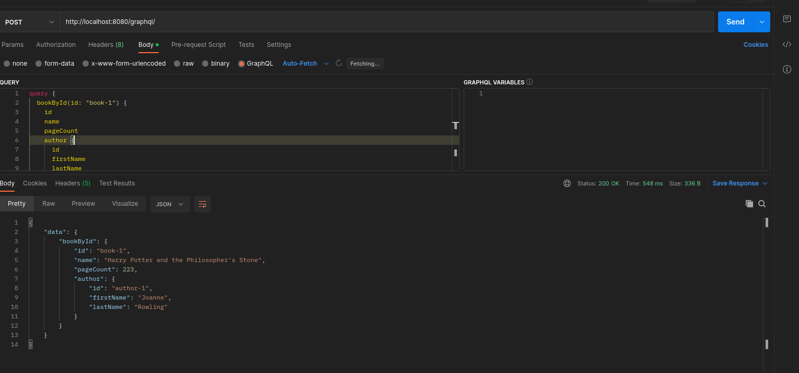

## Spring Graphql

Test With postman on url (POST)
`http://localhost:8080/graphql/`

Sample query
`    query {
        bookById(id: "book-1") {
            id
            name
            pageCount
            author {
                id
                firstName
                lastName
            }
        }
    }`

